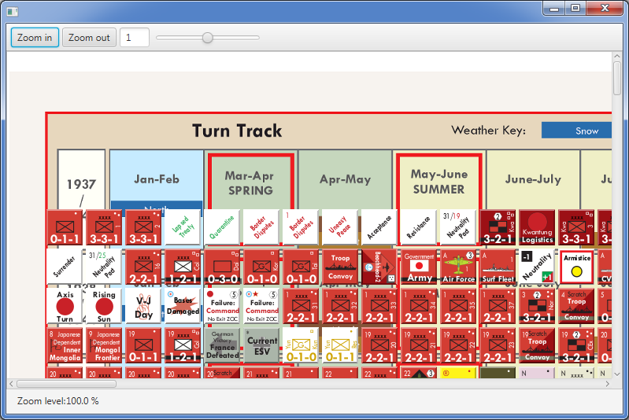

# JavaFX Board game demo
> JavaFX Boardgame Engine Simple Demo

[](https://github.com/boleer/tabula-demo/actions)
[](https://www.gnu.org/licenses/MIT)

## Introduction

This is a simple proof of concept application demonstrating how easy it is to implement a basic board game engine using JavaFX,
as well showing JavaFX performance compared to Swing / AWT. The project is inspired by the [Vassal](https://vassalengine.org) board game engine. Vassal is by far
the most advanced and feature complete board game engine available today.

Note that this application is only a proof of concept, and is as such not properly designed with a clear separation of concerns (MVC).

 

### Features

  The application has the following basic features, needed in any board game engine implementation.

    * Scrollable boardgame map

    * Zooming

    * Counter dragging

    * Counter rotation

    * Counter flipping

    * Counter dropdown menus

    * Animated transitions

    * Property binding

    * Selection box

The application uses the map and counter images from the Vassal *Totaler Krieg* module. All counters (1100 in total) are loaded at startup to show JavaFX's performance with a high number of counters.

### Limitations

  The demo application is by no means a full game engine implementation. The demo application doesn't have support for multi piece dragging, stacking,
  grids, networking, state model or game model for that matter.

### Performance

  JavaFX is hardware accelerated, and performs really well. You can test this out by using the zooming slider. It allows you to zoom
  any zoom level you want in a blink of the eye. The reason JavaFX is so fast.

## Why JavaFX

JavaFX technology is a very good fit for a project of this type:

* Very mature hardware acceleration. Large map images and large number counter images is no problem with either heap usage or performance.\
  Zooming, panning, effects and other transformations on images are hardware accelerated out of the box. JavaFX transparently uses DirectX on
  windows platforms, and OpenGL on iMac and Linux platforms. See [here](http://docs.oracle.com/javafx/2/architecture/jfxpub-architecture.htm) for a good overview of the JavaFX architecture.

* Programming model is a natural fit for application type. A crude prototype allowing you to move counters around on a map, with support for
  counter flipping, counter rotation and map zooming and panning can be written with only 200-300 lines of code.

* Allows for easy development of modern, highly interactive and animated used interface, with clear separation of concerns (model-view-presenter model),
  and a very powerful property binding model.

* Cross platform - Windows, Mac and Linux and possible support port for iOS and android with native images using GraalVM. JavaFX defines API's for handling interaction with
  touch devices (gestures). Support for ARM processors, for example Raspberry PI. Ports for iOS and Android are very looking promising as show [here]({https://www.java.net/community/javafx/video/javafx-everywhere).

* Tooling for JavaFX is very mature, with first class support in NetBeans, Eclipse and IntelliJ. Easy user interface design with [SceneBuilder](http://docs.oracle.com/javafx/scenebuilder/1/user_guide/jsbpub-user_guide.htm) and 
  [ScenicView](http://fxexperience.com/scenic-view/)

* Very good Maven plugin support.

* Several [distribution models](http://docs.oracle.com/javafx/2/deployment/jfxpub-deployment.htm) to choose from - Custom installer support provided by JDK 15+ or native images 
  provided by GraamVM compiler. See [Gluon](https://github.com/gluonhq/gluonfx-maven-plugin) for maven plugin support.

* Very good media and browser support. Embedded browser support is provided through the WebView component which is based on WebKit.

* Obviously using Java gives access to the world's largest set of open source components and frameworks.

Java and JavaFX version

The project is using Java 20 and JavaFX 20. Java 8 introduced Lambda's which allows you to write much more concise code for [JavaFX event handlers](http://learnjavafx.typepad.com/weblog/2013/02/mary-had-a-little-%CE%BB.html?utm_source=feedburner&utm_medium=feed&utm_campaign=Feed%3A+JamesWeaversJavafxBlog+%28James+Weaver%3Fs+JavaFX+Blog%29) and
optimize for multiple cores. JavaFX also introduces new features like touch device support and new controls. 

## Building and running the application

Before building the project locally you need to have <<Maven>> 3.8.x+ and JDK 20 installed.

### Building

  To build the project simply run:

```
mvn package
```

### Running the application

```
mvn exec:java
```

